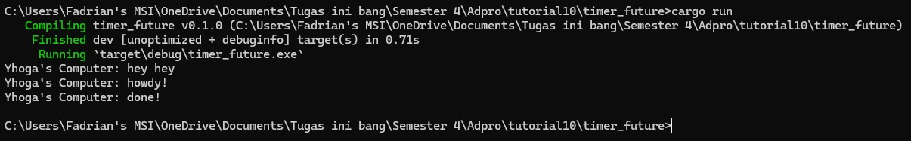
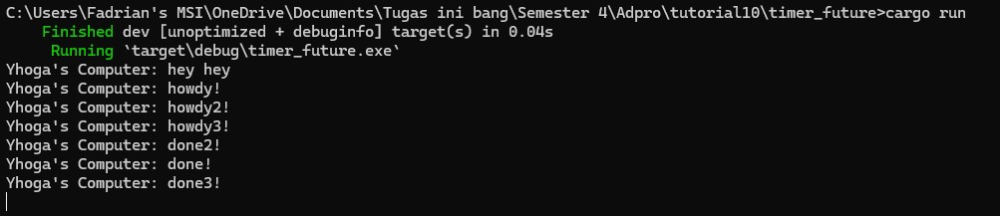

# Pemrograman Lanjut A
> Fadrian Yhoga Pratama - 2206819395

## Module 10 - Asynchoronous Programming - Timer

## 1.2. Understanding how it works.

Berdasarkan gambar diatas, dapat dilihat bahwa print statement "hey hey" jalan lebih dulu kemudian baru "howdy!" dan "done!". Ini terjadi karena print statement "hey "hey" berada di main() bukan di asynchronous task. Jadi, meskipun task berada sebelum print statement "hey hey", namun task tersebut baru dieksekusi setelahnya oleh Executor. 

## 1.3. Multiple Spawn and removing drop
### **Before removing drop**

### **After removing drop**

Berdasarkan gambar diatas, dapat dilhat bahwa programnya tidak berhenti. Ini terjadi karena function `drop(spawner)` tidak dijalankan yang membuat tidak ada penanda ke executor bahwa sudah tidak ada task lagi yang akan ditambahan. Lalu, urutan tasknya tidak teratur karena task tersebut berjalan secara asynchronous (tidak menunggu satu sama lain untuk selesai).